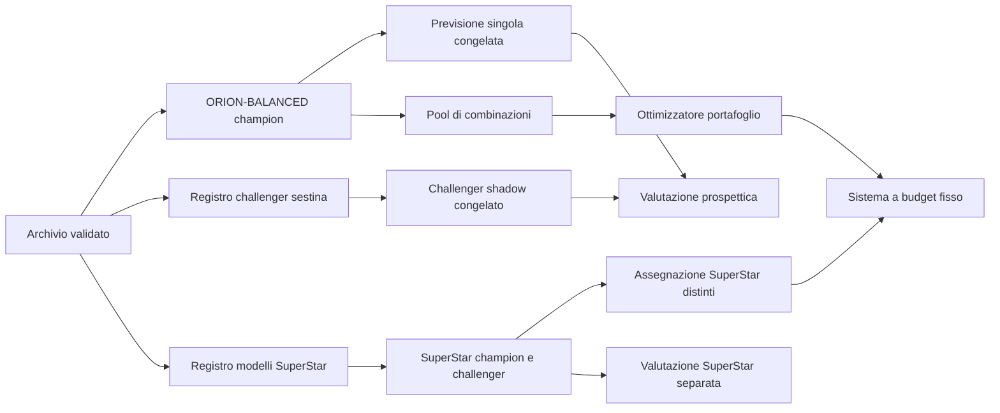

# ORION v2.7.6 — FORGE Algorithm Lab

Stato: progetto tecnico pronto per l'implementazione
Base applicativa: v2.7.5.2
Versione algoritmo ORION champion: 2.7.4, invariata
Versione FORGE proposta: 3.0.0

## 1. Decisione architetturale

La v2.7.6 deve migliorare due aspetti distinti senza presentarli come equivalenti:

1. **Ricerca predittiva**: confrontare famiglie di modelli realmente diverse, sempre in shadow mode finché non superano il champion su dati prospettici.
2. **Ottimizzazione della giocata**: distribuire un budget su sestine e SuperStar differenti per aumentare la copertura acquistata e ridurre le sovrapposizioni.

Non esiste una modifica autorizzata al champion. `ORION-BALANCED` continua a produrre la proposta principale e può essere sostituito soltanto dalla procedura FORGE già protetta.



## 2. Invarianti non negoziabili

- `ORION-BALANCED` conserva pesi, memorie, scoring, pool, filtri strutturali e selezione della sestina attuali.
- `core/orion.py` e il percorso champion di `core/metrics.py` non cambiano risultato.
- `prospective_minimum` resta **100**.
- Il backtest storico può ammettere un modello in shadow, ma non può promuoverlo.
- La promozione della sestina resta basata esclusivamente sui sei numeri principali.
- Il SuperStar non entra in `average_delta`, `champion_mean`, `challenger_mean`, `champion_2_plus` o `challenger_2_plus`.
- Ogni previsione viene congelata e registrata prima dell'estrazione target.
- Nessun dato futuro può partecipare a training, scelta dei parametri, calibrazione o generazione.
- Una correzione invalida soltanto le previsioni future che dipendono dal dato corretto.
- I risultati devono essere deterministici a parità di archivio, configurazione e seed.

## 3. Contratto comune dei modelli

I challenger non devono più essere rappresentati soltanto da tre pesi. Serve un contratto capace di ospitare famiglie differenti.

```python
@dataclass(frozen=True)
class ModelSpec:
    model_id: str
    label: str
    family: str
    algorithm_version: str
    target: Literal["main", "superstar"]
    parameters: Mapping[str, object]
    enabled: bool = True

@dataclass(frozen=True)
class NumberForecast:
    model_id: str
    scores: Mapping[int, float]
    probabilities: Mapping[int, float] | None
    primary: tuple[int, int, int, int, int, int]
    candidates: tuple[tuple[float, tuple[int, ...]], ...]
    diagnostics: Mapping[str, object]

@dataclass(frozen=True)
class SuperStarForecast:
    model_id: str
    ranking: tuple[tuple[int, float], ...]
    probabilities: Mapping[int, float] | None
    primary: int
    diagnostics: Mapping[str, object]
```

Ogni `model_id` è il digest deterministico di:

- famiglia;
- versione dell'algoritmo;
- parametri effettivi;
- schema delle feature;
- versione della policy di generazione.

Il nome mostrato all'utente non deve partecipare al comportamento del modello.

## 4. Famiglie per la sestina

### 4.1 Champion protetto

`ORION-BALANCED`

- Implementazione attuale invariata.
- Pesi `0.35 / 0.25 / 0.40` invariati.
- Memorie `25 / 50 / 100 / 200 / storico` invariate.
- Penalità di instabilità, pool 18, limite 200 e filtri invariati.

Un test snapshot deve dimostrare che la proposta champion della v2.7.6 coincide byte per byte con quella della v2.7.5.2 sullo stesso archivio.

### 4.2 Controllo casuale

`UNIFORM-HASH-V1`

- Estrae sei numeri distinti con seed derivato da firma dell'archivio, modello e concorso sorgente.
- È riproducibile e non usa il target.
- Non è eleggibile alla promozione automatica: serve come controllo sperimentale e per misurare quanto rumore può sembrare un vantaggio.

### 4.3 Bayesian shrinkage

`BAYES-DIRICHLET-V1`

- Conta le inclusioni dei 90 numeri nello storico disponibile.
- Applica un prior simmetrico centrato su `6/90`.
- Riduce verso l'uniforme le differenze non sostenute dai dati.
- Produce probabilità normalizzate e non soltanto score min-max.
- Il parametro di shrinkage viene congelato prima dell'holdout; non viene ricalibrato sul target.

Prima configurazione da valutare:

- prior debole, medio e forte selezionati soltanto nel blocco di sviluppo;
- il vincitore della famiglia entra nel confronto tra famiglie;
- soltanto un modello complessivo raggiunge l'holdout finale.

### 4.4 Multi-orizzonte EMA

`MULTI-EMA-V1`

- Usa indicatori di presenza per ogni numero.
- Calcola tre decadimenti esponenziali con emivite 8, 26 e 78 estrazioni.
- Combina corto, medio e lungo periodo con pesi congelati dopo lo sviluppo.
- Non usa il concetto di “numero dovuto”.

### 4.5 Coppie con shrinkage

`PAIR-SHRINK-V1`

- Parte da probabilità individuali regolarizzate.
- Calcola la co-occorrenza delle coppie rispetto all'atteso.
- Applica pseudoconteggi e un limite massimo al contributo di ogni coppia.
- Il contributo complessivo delle coppie non può superare il 20% della qualità di una sestina.
- Le terne restano inizialmente solo una metrica diagnostica: con 1.189 estrazioni sarebbero troppo sparse per uno score affidabile.

### 4.6 Stacking, fase successiva

`CALIBRATED-STACK-V1` viene progettato ma resta disabilitato nella prima release.

Potrà combinare le previsioni out-of-fold di ORION, Bayes, EMA e Pair-Shrink tramite regressione logistica regolarizzata. Gradient boosting e reti neurali non entrano nella prima release perché la dimensione dell'archivio è insufficiente rispetto al rischio di overfitting.

Condizione per abilitarlo: almeno 300 previsioni out-of-fold complete per ogni componente e nessun uso delle osservazioni target nella calibrazione.

## 5. Torneo retrospettivo FORGE

La validazione resta cronologica e viene estesa alle famiglie:

1. warm-up minimo di 200 estrazioni per i modelli di interazione;
2. blocco di sviluppo per selezionare una sola configurazione per famiglia;
3. holdout successivo e mai utilizzato per la selezione dei parametri;
4. confronto con champion e baseline uniforme;
5. correzione Holm tra le famiglie nel report retrospettivo;
6. ingresso in shadow soltanto per il miglior candidato non chiaramente dominato.

La correzione multipla è diagnostica e governa l'ammissione al torneo; non modifica la logica prospettica di promozione già in produzione.

Metriche della proposta singola:

- media dei numeri indovinati;
- distribuzione 0–6;
- eventi `2+` e `3+`;
- delta appaiato contro champion;
- intervallo bootstrap appaiato;
- richiamo del target nei pool Top 12 e Top 18;
- Brier score e log-loss per i modelli che producono probabilità;
- stabilità annuale;
- confronto con la media teorica casuale di `0,4`.

## 6. Competizione prospettica della sestina

Resta attiva una sola coppia champion/challenger per volta.

La promozione conserva le regole correnti:

- almeno 100 coppie prospettiche valide;
- `average_delta > 0`;
- limite inferiore dell'intervallo appaiato maggiore di zero;
- numero di eventi `2+` del challenger non inferiore al champion.

Il conteggio include soltanto coppie che:

- hanno la stessa sorgente e lo stesso target;
- sono state create prima delle 20:00 Europe/Rome della data target;
- hanno entrambe le righe nello stato `evaluated`;
- non sono state invalidate da correzioni;
- appartengono ai due `model_id` attivi.

Un cambio di challenger inizia un nuovo campione per quella coppia di modelli. Le osservazioni precedenti restano nel database per audit, ma non vengono riciclate.

## 7. SuperStar: modello e giocata sono separati

### 7.1 Champion SuperStar

`SUPERSTAR-LEGACY-V1`

- Mantiene lo score attuale `frequenza 0.40 / ritardo 0.25 / recenza 0.35`.
- Resta champion protetto nella prima release.
- La sua previsione singola continua a essere congelata prospetticamente.

### 7.2 Challenger SuperStar

- `SS-UNIFORM-HASH-V1`: baseline uniforme riproducibile.
- `SS-BAYES-V1`: frequenze con prior simmetrico verso `1/90`.
- `SS-ROLLING30-V1`: frequenza nelle ultime 30 estrazioni, con tie-break deterministico.
- `SS-MULTI-EMA-V1`: emivite 8, 26 e 78.

Il primo challenger da mettere in shadow è scelto con walk-forward storico, ma la promozione richiede almeno 100 osservazioni prospettiche proprie.

### 7.3 Metriche SuperStar

- `count`: una osservazione per concorso target;
- `hits`;
- `hit_rate`;
- riferimento uniforme `1/90`;
- intervallo binomiale esatto;
- p-value binomiale riportato come diagnostica;
- Brier score e log-loss se il modello produce probabilità;
- Top-K hit rate per la copertura dei sistemi, confrontato con `K/90`.

Le statistiche SuperStar non sono aggregate alle metriche della sestina.

### 7.4 Assegnazione alle schedine

La previsione `primary` e il portafoglio dei SuperStar sono oggetti differenti.

- Proposta singola: usa il `primary` del champion SuperStar.
- Sistema con K righe, `K <= 90`: assegna i primi K valori **distinti** del ranking congelato.
- Sistema con K righe, `K > 90`: completa i 90 valori prima di ripetere il ranking.
- L'associazione riga/SuperStar è deterministica.
- Il CSV contiene il SuperStar specifico di ogni riga.

Con K valori distinti vengono coperti K possibili esiti SuperStar su 90; questa è copertura acquistata, non prova di previsione.

## 8. Ottimizzatore del portafoglio di sestine

### 8.1 Obiettivo

Dato un budget di K righe e un insieme di candidate congelato:

- selezionare esattamente K sestine uniche;
- aumentare la copertura di coppie e terne nel pool;
- ridurre la sovrapposizione tra righe;
- conservare qualità sufficiente secondo lo score del modello attivo;
- non modificare la probabilità dichiarata della singola combinazione.

### 8.2 Candidate

- Il champion produce il proprio ranking attuale senza modifiche.
- L'ottimizzatore riceve al massimo le migliori 500 sestine ammissibili.
- Per la modalità compatta il pool predefinito resta 12.
- I sistemi integrali restano esaustivi e non passano dall'ottimizzatore.

### 8.3 CP-SAT

La soluzione primaria usa OR-Tools CP-SAT con un timeout breve e deterministico.

Variabili:

- `x_i`: la sestina candidata i è scelta;
- `y_p`: la coppia p è coperta;
- `z_t`: la terna t è coperta.

Vincoli:

- `sum(x_i) = K`;
- `y_p <= sum(x_i)` per le righe che contengono p;
- `z_t <= sum(x_i)` per le righe che contengono t;
- coppie di schedine con sovrapposizione superiore al limite configurato non possono essere scelte insieme.

Obiettivo intero normalizzato:

- 45% qualità delle righe;
- 35% copertura delle coppie;
- 20% copertura delle terne.

Questi sono pesi dell'ottimizzatore di portafoglio, non pesi dell'algoritmo ORION. Devono essere versionati e mostrati nei dettagli tecnici.

Configurazione iniziale:

- timeout 3 secondi;
- seed fisso derivato dalla firma dell'archivio;
- sovrapposizione massima preferita 4 numeri;
- stato del solver salvato come `optimal`, `feasible`, `timeout` o `fallback`.

### 8.4 Fallback

Se CP-SAT non trova una soluzione nel timeout:

1. selezione greedy submodulare già deterministica;
2. miglioramento locale 1-swap e 2-swap;
3. stessa funzione obiettivo e stessi vincoli di unicità;
4. indicazione `fallback` visibile nel report.

La generazione non deve fallire solo perché il solver opzionale non è disponibile.

### 8.5 Metriche del sistema

- righe e costo totale;
- coppie coperte / coppie possibili nel pool;
- terne coperte / terne possibili nel pool;
- sovrapposizione media e massima;
- qualità minima, media e massima delle righe;
- numero di SuperStar distinti;
- esito del solver e durata;
- firma riproducibile del sistema.

Il backtest dei sistemi confronta portafogli con lo stesso numero di righe e lo stesso costo:

- miglior punteggio ottenuto da almeno una riga;
- righe con `2+` e `3+`;
- concorsi con almeno una riga `2+` e `3+`;
- copertura del target nei Top 12/18;
- confronto con K sestine casuali uniche.

## 9. Persistenza Supabase

### 9.1 Tabelle esistenti riutilizzate

- `forge_experiments_v2`: conserva esperimenti di qualunque famiglia dentro `configuration`, `metrics` e `checks`.
- `forge_state`: resta lo stato autorevole della competizione della sestina.
- `forge_predictions`: resta il registro prospettico della sestina.

`FORGE_VERSION` passa a `3.0.0`; le righe `2.0.0` restano disponibili per audit e non vengono cancellate.

### 9.2 Nuova tabella `forge_superstar_state`

```sql
create table if not exists public.forge_superstar_state (
    id smallint primary key default 1 check (id = 1),
    mode text not null default 'shadow',
    champion_model jsonb not null default '{}'::jsonb,
    challenger_model jsonb null,
    prospective_minimum integer not null default 100,
    note text null,
    updated_at timestamptz not null default now()
);
```

Viene aggiunto in modo idempotente un vincolo che impone `prospective_minimum = 100`.

### 9.3 Nuova tabella `forge_superstar_predictions`

```sql
create table if not exists public.forge_superstar_predictions (
    prediction_key text primary key,
    archive_signature text not null,
    forge_version text not null,
    source_year integer not null,
    source_contest integer not null,
    source_date date not null,
    role text not null check (role in ('champion', 'challenger')),
    model_id text not null,
    model_config jsonb not null default '{}'::jsonb,
    predicted_superstar smallint not null check (predicted_superstar between 1 and 90),
    status text not null default 'pending'
        check (status in ('pending', 'evaluated', 'void')),
    target_year integer null,
    target_contest integer null,
    target_date date null,
    target_superstar smallint null check (target_superstar between 1 and 90),
    superstar_hit boolean null,
    created_at timestamptz not null default now(),
    evaluated_at timestamptz null
);
```

Indici:

- unique parziale su `(forge_version, source_year, source_contest, role)` per i soli `pending`;
- composito su `(forge_version, status, model_id, target_date)`;
- indice su `(source_date)` per l'invalidazione temporale.

### 9.4 Backfill

- Le 1.189 estrazioni e i relativi SuperStar vengono usati direttamente per training e backtest tramite `estrazioni`.
- Non si costruiscono false previsioni storiche dai risultati già noti.
- Possono essere copiate nella nuova tabella soltanto le vecchie righe con `predicted_superstar` realmente non nullo e `created_at` precedente al cutoff del target.
- Il backfill sceglie una sola osservazione per concorso, preferendo la riga champion, per evitare duplicazioni.
- Le righe con dato previsto mancante restano mancanti.

### 9.5 RLS e privilegi

Il database live ha RLS attiva sulle tabelle FORGE, nessuna policy pubblica e accesso applicativo server-side. La nuova migrazione conserva lo stesso modello:

- RLS abilitata;
- nessuna policy `anon` o `authenticated`;
- revoca esplicita a `PUBLIC`, `anon` e `authenticated`;
- privilegi minimi al ruolo server utilizzato dall'app;
- nessuna funzione `SECURITY DEFINER` esposta all'esecuzione pubblica.

### 9.6 Idempotenza

- `create table if not exists` per le tabelle;
- `add column if not exists` per estensioni additive;
- `create index if not exists` per gli indici;
- blocchi `DO` con controllo su `pg_constraint` per i vincoli, perché PostgreSQL non supporta `add constraint if not exists`;
- upsert atomici con `on conflict`;
- migrazione eseguibile due volte senza cambiare il risultato.

## 10. Matrice delle correzioni

| Correzione su `estrazioni` | Previsioni sestina valutate | Previsioni sestina future | Previsioni SS valutate | Previsioni SS future |
|---|---:|---:|---:|---:|
| Solo Jolly | Nessuna azione | Nessuna azione | Nessuna azione | Nessuna azione |
| Solo data, identità invariata | Allinea audit | Allinea audit | Allinea audit | Allinea audit |
| Uno dei sei numeri | Rivaluta target | Void da quella sorgente in avanti | Nessuna azione | Nessuna azione |
| Solo SuperStar | Nessuna azione | Nessuna azione | Rivaluta target | Void da quella sorgente in avanti |
| Numero principale e SuperStar | Rivaluta target | Void dipendenti | Rivaluta target | Void dipendenti |
| Anno/concorso o eliminazione | Void dal cutoff | Void dal cutoff | Void dal cutoff | Void dal cutoff |
| Inserimento storico | Void dal cutoff | Void dal cutoff | Void dal cutoff | Void dal cutoff |
| Inserimento più recente | Valuta i pending precedenti | Conserva nuova coppia | Valuta i pending precedenti | Conserva nuova coppia |

Il trigger esegue solo aggiornamenti brevi. Calcoli e backtest restano fuori dalla transazione database.

## 11. Interfaccia utente

### 11.1 Proposta singola

- Mostra la sestina champion come oggi.
- Mostra il SuperStar champion con etichetta “modello in produzione”.
- Aggiunge una nota breve: “ranking sperimentale; ogni numero mantiene probabilità teorica 1/90”.
- Il challenger non sostituisce la proposta visibile finché non viene promosso.

### 11.2 Sistema

- Mantiene i profili Compatto, Equilibrato e Integrale.
- Il profilo Compatto usa l'ottimizzatore CP-SAT con fallback.
- La tabella presenta un SuperStar diverso per ogni riga quando l'opzione è attiva.
- Il CSV mantiene `N1..N6` e aggiunge il SuperStar della singola riga.
- Il riepilogo mostra copertura coppie, copertura terne, overlap massimo e SuperStar distinti.

### 11.3 Stato FORGE

Due pannelli separati:

1. **Sestina**: champion, challenger, conteggio `/100`, delta, intervallo, `2+`, decisione.
2. **SuperStar**: champion, challenger, conteggio `/100`, hit rate, riferimento `1/90`, intervallo, decisione.

I backtest storici sono marcati “retrospettivi” e non vengono mostrati come risultati prospettici.

## 12. Modifiche previste per file

Nuovi file:

- `core/model_contracts.py` — dataclass e protocolli comuni.
- `core/model_registry.py` — registro versionato delle famiglie.
- `core/number_models.py` — Uniform, Bayes, EMA, Pair-Shrink.
- `core/superstar_models.py` — Legacy, Uniform, Bayes, Rolling30, EMA.
- `core/portfolio_optimizer.py` — CP-SAT, greedy e local search.
- `core/evaluation.py` — metriche condivise, calibrazione e confronti.
- `services/superstar_forge_service.py` — ciclo prospettico autonomo.
- `FORGE_V3_SUPABASE.sql` — migrazione idempotente.
- test dedicati per ogni modulo.

File modificati:

- `core/forge.py` — `ForgeModel` generalizzato a `ModelSpec`.
- `core/experiments.py` — torneo tra famiglie e metriche Top-K/calibrazione.
- `services/forge_service.py` — dispatch per famiglia senza alterare il champion.
- `database.py` — persistenza SuperStar separata e migrazione v3.
- `app.py` — nuovi pannelli e sistemi con SuperStar distinti.
- `requirements.txt` — OR-Tools con versione bloccata; lockfile rigenerato.
- `VERSION`, `CHANGELOG.md`, `README.md`.

File il cui comportamento champion non deve cambiare:

- `core/orion.py`;
- `core/metrics.py`, salvo eventuale wrapper che mantenga identico l'output legacy;
- filtri e qualità usati dalla proposta singola champion in `core/combinations.py`.

## 13. Test obbligatori

### 13.1 Regressione champion

- snapshot della sestina, ranking e firma su archivio noto;
- parità tra percorso live e walk-forward;
- nessuna modifica dei pesi e della policy.

### 13.2 No look-ahead

- ogni target vede soltanto righe con indice precedente;
- tuning confinato allo sviluppo;
- holdout inaccessibile alla selezione;
- previsione registrata prima del cutoff target;
- date future rifiutate.

### 13.3 Modelli

- probabilità valide e finite;
- somma coerente con il contratto;
- stesso input e seed producono lo stesso output;
- archivi piccoli degradano in modo controllato;
- nessun modello può produrre numeri fuori 1–90 o duplicati.

### 13.4 Portafoglio

- esattamente K righe uniche;
- costo invariato rispetto a K;
- vincoli di overlap rispettati quando fattibili;
- fallback equivalente nel contratto;
- coperture ricalcolate indipendentemente dal solver;
- K SuperStar distinti per `K <= 90`.

### 13.5 Supabase

- migrazione eseguita due volte;
- RLS e privilegi verificati;
- unique parziale sui pending;
- upsert concorrente senza duplicati;
- correzione dei sei numeri non invalida il SuperStar se invariato;
- correzione del solo SuperStar non invalida la sestina;
- backfill senza invenzione di previsioni;
- `prospective_minimum = 100` sempre.

### 13.6 Statistiche

- una osservazione SuperStar per target;
- champion e challenger uguali non raddoppiano il count;
- righe nulle escluse;
- baseline esatte `0,4` per la sestina e `1/90` per il SuperStar;
- confronto dei sistemi sempre a budget uguale.

## 14. Rollout

### Fase A — Motori offline

- Implementare contratti, modelli e test.
- Eseguire walk-forward completo sulle 1.189 estrazioni.
- Pubblicare un report con risultati per famiglia e baseline.
- Nessuna modifica alla proposta visibile.

### Fase B — Shadow mode

- Applicare la migrazione v3.
- Registrare champion/challenger della sestina e del SuperStar prima del target.
- Esporre i due contatori tecnici.
- Nessuna promozione retroattiva.

### Fase C — Portafoglio

- Attivare CP-SAT dietro feature flag.
- Confrontare il sistema nuovo con il greedy attuale a stesso budget.
- Attivare SuperStar distinti nel CSV e nella tabella.

### Fase D — Produzione

- Rimuovere la feature flag soltanto dopo test applicativi e database.
- Conservare il fallback greedy.
- Promozioni future soltanto attraverso FORGE e minimo 100.

## 15. Rollback

- Il champion non viene sostituito durante il deploy.
- Le nuove tabelle sono additive e possono restare inutilizzate.
- La feature flag riporta immediatamente il sistema al generatore v2.7.5.2.
- Le previsioni v3 restano per audit; non vengono cancellate.
- Nessun rollback richiede la perdita di dati o la rimozione delle colonne SuperStar esistenti.

## 16. Criteri di accettazione della v2.7.6

La release è pronta quando:

1. tutti i test esistenti e nuovi sono verdi;
2. l'output champion è invariato;
3. il torneo confronta almeno Uniform, Bayes, EMA e Pair-Shrink;
4. il SuperStar ha stato e previsioni prospettiche separati;
5. il sistema compatto genera righe uniche con SuperStar distinti;
6. CP-SAT ha un fallback verificato;
7. la migrazione è idempotente e gli advisor Supabase non segnalano nuovi problemi;
8. una query di verifica dimostra RLS, indici, vincoli e count prospettici corretti;
9. il report distingue esplicitamente previsione, copertura e riduzione della condivisione del premio;
10. `prospective_minimum` è ancora 100.

## 17. Esclusioni intenzionali

- Nessuna promessa di aumentare la probabilità fisica di estrazione.
- Nessuna rete neurale profonda nella prima release.
- Nessun cambio automatico di champion basato sul backtest.
- Nessun uso del Jolly nello scoring.
- Nessun uso delle statistiche SuperStar nella promozione della sestina.
- Nessuna ricostruzione a posteriori di previsioni mai registrate.
- Nessuna modifica distruttiva al database live.

## 18. Basi tecniche consultate

- Regolamento ufficiale SuperEnalotto/SuperStar: urna separata, non prevedibilità e uguale probabilità.
- Expert Lotto: backtest, filtri e wheel optimization.
- Jans e Degraeve: formulazione del lottery problem come Integer Linear Programming/set covering.
- Cushing e Stewart: constraint programming per minimal lottery designs.
- Mohammadi e Nakhaei Kamal Abadi: metaeuristica e local search per il lottery problem.
- Haigh: preferenze non uniformi dei giocatori e impatto sulla condivisione del premio.

Riferimenti:

- https://www.superenalotto.it/content/dam/gntn/superenalotto/documenti/REGOLAMENTO_SE_2021.pdf
- https://www.expertlotto.com/en/features/
- https://www.sciencedirect.com/science/article/pii/S037722170700183X
- https://link.springer.com/article/10.1007/s10601-024-09368-5
- https://www.sciencedirect.com/science/article/pii/S1026309812000909
- https://rss.onlinelibrary.wiley.com/doi/abs/10.1111/1467-985X.00056
